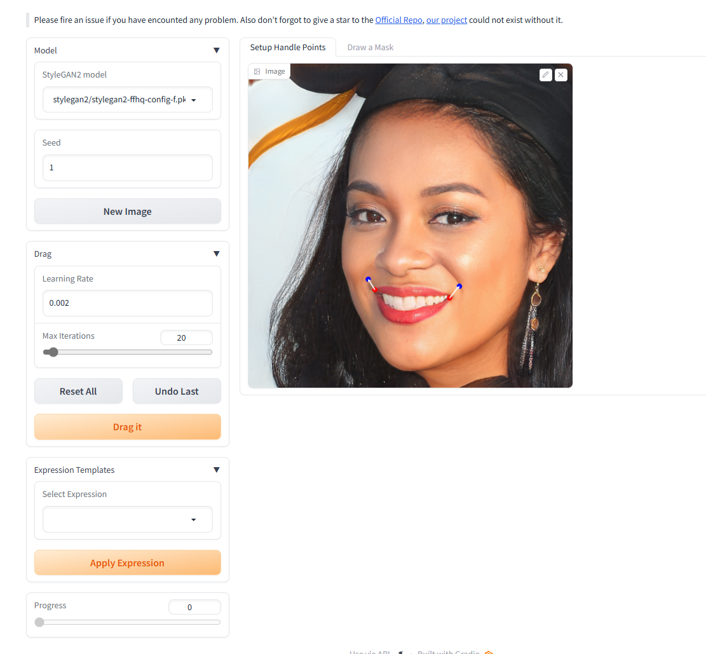
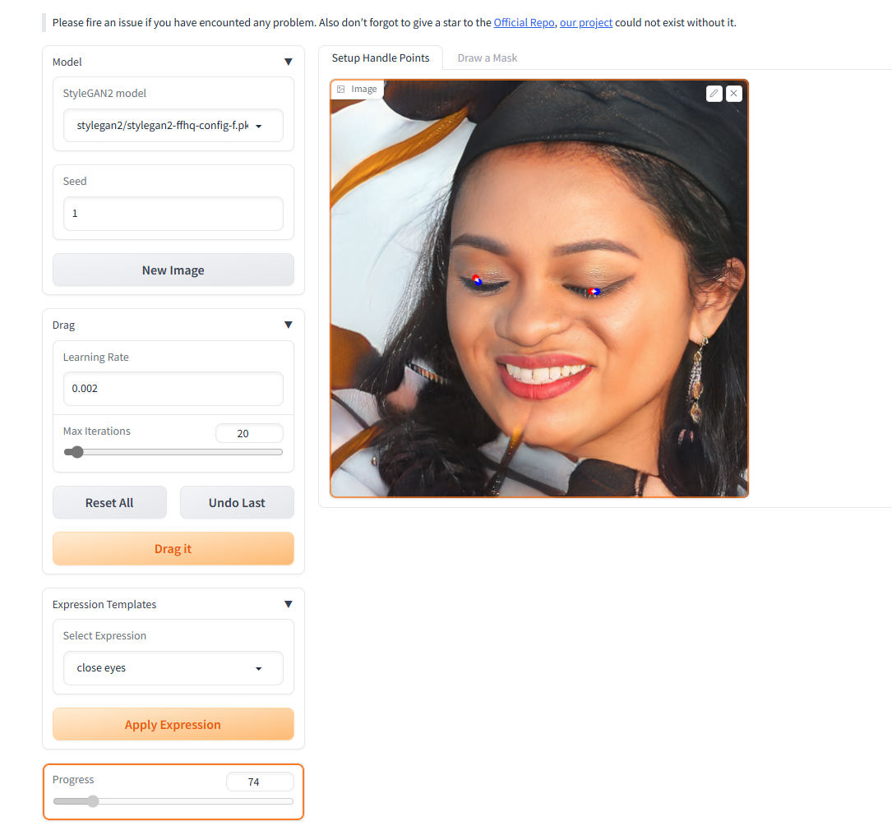
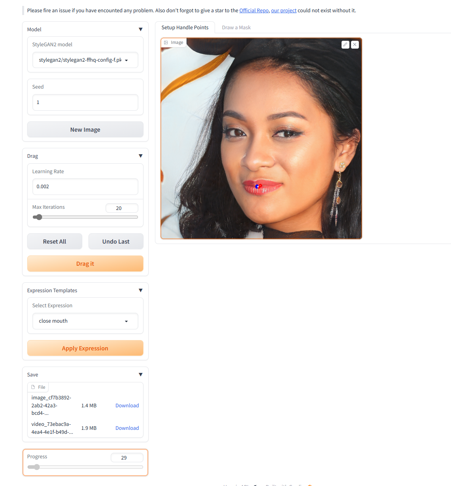

# 2.  Part2-Play with GANs

## Install

run:

```bash
conda create -n draggan python=3.7
conda activate draggan
pip install -r requirements.txt
```

## Launch

因为gradio和代理冲突要unset http_proxy,不过因为没unset https所以运行的时候还是可以下载模型,出现bug详见[Issues · OpenGVLab/DragGAN](https://github.com/OpenGVLab/DragGAN/issues)

run:

```bash
python gradio_app.py --share
```


## Result

主界面如下,依旧可以选点变换,增加了表情模版选项,直接选择模板可以让人物直接进行变换,简单弄了两个闭眼和闭嘴模板,因为原实现要自定义图片需要先用PTI转换,并未加进本次作业实现中.





